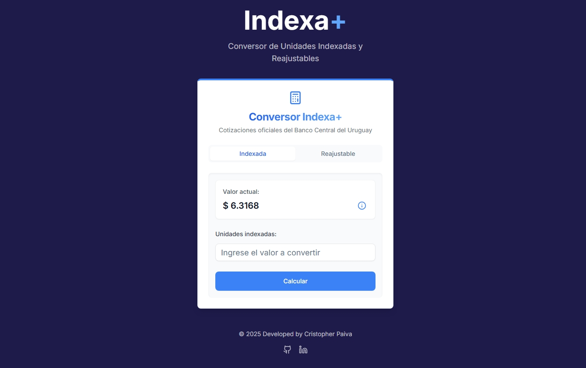

# Indexa+

Indexa+ es una aplicación web desarrollada con [Next.js](https://nextjs.org) que permite convertir entre **Unidades Indexadas (UI)** y **Unidades Reajustables (UR)**, utilizando las cotizaciones oficiales proporcionadas por el Banco Central del Uruguay (BCU). La aplicación está diseñada para ser rápida, accesible y fácil de usar, con soporte para dispositivos móviles y de escritorio.



Para obtener las cotizaciones oficiales, se creó un servicio API independiente que centraliza y expone los datos del BCU. Puedes encontrar el código fuente de este servicio en el siguiente repositorio: [cotizaciones_UI_UR_BCU](https://github.com/cristopherpds/cotizaciones_UI_UR_BCU).

## Características

- **Conversión en tiempo real**: Calcula el valor en pesos uruguayos a partir de Unidades Indexadas o Reajustables.
- **Cotizaciones oficiales**: Obtiene las cotizaciones más recientes directamente desde el servicio API.
- **Interfaz accesible**: Incluye soporte para lectores de pantalla y navegación por teclado.
- **Diseño moderno**: Construido con Tailwind CSS para un diseño limpio y responsivo.
- **Caché local**: Optimiza las consultas mediante almacenamiento en caché para mejorar el rendimiento.

## Tecnologías Utilizadas

- **Next.js**: Framework de React para renderizado del lado del servidor y generación de sitios estáticos.
- **TypeScript**: Tipado estático para un desarrollo más seguro y mantenible.
- **Tailwind CSS**: Framework de utilidades para estilos rápidos y consistentes.
- **Radix UI**: Componentes accesibles y personalizables.
- **Framer Motion**: Animaciones fluidas y modernas.
- **API del BCU**: Fuente de datos para las cotizaciones de UI y UR, consumida a través del servicio API mencionado.

## Cómo Empezar

Sigue estos pasos para ejecutar el proyecto en tu entorno local:

1. Clona el repositorio:

   ```bash
   git clone https://github.com/tu-usuario/indexa.git
   cd indexa
   ```

2. Instala las dependencias:

    ```bash
    npm install
    ```

3. Inicia el servidor de desarrollo:

    ```bash
    npm run dev
    ```

4. Abre http://localhost:3000 en tu navegador para ver la aplicación.

## Estructura del Proyecto

- **`app/`**: Contiene las páginas principales de la aplicación, incluyendo el diseño global y la página de inicio.
- **`components/`**: Componentes reutilizables como el conversor, botones, tarjetas y otros elementos de la interfaz.
- **`lib/`**: Funciones auxiliares para la interacción con la API, manejo del caché y lógica compartida.
- **`public/`**: Archivos estáticos como imágenes, íconos y otros recursos accesibles públicamente.
- **`styles/`**: Configuración de Tailwind CSS y estilos globales personalizados.

## Contribuciones

Las contribuciones son bienvenidas. Si encuentras un problema, tienes una idea para mejorar la aplicación o deseas colaborar, no dudes en abrir un issue o enviar un pull request en el repositorio. ¡Tu ayuda es muy apreciada!
