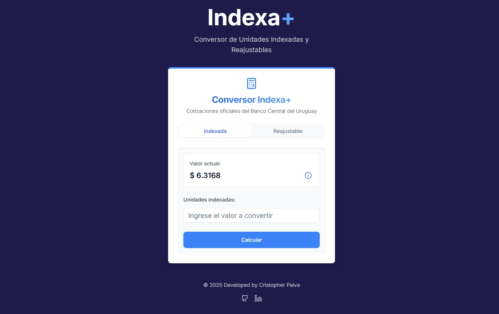

# Indexa+

Indexa+ es una aplicación web desarrollada con [Next.js](https://nextjs.org) que permite convertir **Unidades Indexadas (UI)**, **Unidades Reajustables (UR)** y **Unidades Previsionales (UP)** a pesos uruguayos, utilizando las cotizaciones oficiales del Banco Central del Uruguay (BCU). La aplicación está diseñada para ser rápida, accesible y fácil de usar, con soporte para dispositivos móviles y de escritorio.



Las cotizaciones se obtienen directamente de los [web services oficiales de cotizaciones del BCU](https://www.bcu.gub.uy/Estadisticas-e-Indicadores/Paginas/Cotizaciones.aspx) (SOAP), sin servicios intermedios.

## Características

- **Conversión en tiempo real**: Calcula el valor en pesos uruguayos a partir de Unidades Indexadas, Reajustables o Previsionales.
- **Cotizaciones oficiales**: Consume los web services del BCU (`awsbcucotizaciones` y `awsultimocierre`), usando siempre la fecha del último cierre publicado — por lo que también funciona en fines de semana y feriados.
- **Caché en el servidor**: Las cotizaciones se cachean durante 1 hora, de modo que las visitas no generan llamadas innecesarias al BCU y la respuesta es inmediata.
- **Interfaz accesible**: Incluye soporte para lectores de pantalla (live regions, etiquetas ARIA) y navegación por teclado.
- **Diseño moderno**: Construido con Tailwind CSS para un diseño limpio y responsivo.

## Tecnologías Utilizadas

- **Next.js (App Router)**: Framework de React. Los route handlers actúan de puente entre el navegador y los web services SOAP del BCU.
- **TypeScript**: Tipado estático para un desarrollo más seguro y mantenible.
- **Tailwind CSS**: Framework de utilidades para estilos rápidos y consistentes.
- **Radix UI**: Componentes accesibles y personalizables.
- **Framer Motion**: Animaciones fluidas y modernas.
- **Web services del BCU**: Fuente oficial de las cotizaciones de UI, UR y UP.

## API interna

La aplicación expone un endpoint propio que devuelve la cotización vigente en JSON:

```
GET /api/cotizacion/ui   → Unidad Indexada    (código BCU 9800)
GET /api/cotizacion/ur   → Unidad Reajustable (código BCU 9900)
GET /api/cotizacion/up   → Unidad Previsional (código BCU 9700)
```

Respuesta de ejemplo:

```json
{
  "fecha": "2026-07-29",
  "metadata": {
    "fecha_consulta": "2026-07-30T04:13:55.392Z",
    "fuente": "Banco Central del Uruguay (awsbcucotizaciones)"
  },
  "moneda": "UYU",
  "tipo": "UI",
  "valor": 6.6276
}
```

## Cómo Empezar

Sigue estos pasos para ejecutar el proyecto en tu entorno local:

1. Clona el repositorio:

   ```bash
   git clone https://github.com/cristopherpds/indexa.git
   cd indexa
   ```

2. Instala las dependencias:

    ```bash
    npm install
    ```

3. Inicia el servidor de desarrollo:

    ```bash
    npm run dev
    ```

4. Abre http://localhost:3000 en tu navegador para ver la aplicación.

### Variables de entorno

| Variable | Descripción |
|---|---|
| `NEXT_PUBLIC_SITE_URL` | URL pública del sitio en producción (por ejemplo `https://indexa.example.com`). Se usa para generar las URLs absolutas de los metadatos Open Graph/Twitter. Opcional en desarrollo. |

## Estructura del Proyecto

- **`app/`**: Páginas, diseño global y metadatos (favicon, imagen Open Graph).
  - **`app/api/cotizacion/[tipo]/`**: Route handler que sirve las cotizaciones en JSON.
- **`components/`**: Componentes reutilizables como el conversor, botones, tarjetas y otros elementos de la interfaz.
- **`lib/`**:
  - **`bcu.ts`**: Cliente SOAP de los web services del BCU, con caché de servidor (1 hora).
  - **`api.ts`**: Cliente que consume la API interna desde el navegador.
  - **`utils.ts`**: Utilidades compartidas.
- **`public/`**: Archivos estáticos como imágenes, íconos y otros recursos accesibles públicamente.

## Contribuciones

Las contribuciones son bienvenidas. Si encuentras un problema, tienes una idea para mejorar la aplicación o deseas colaborar, no dudes en abrir un issue o enviar un pull request en el repositorio. ¡Tu ayuda es muy apreciada!
